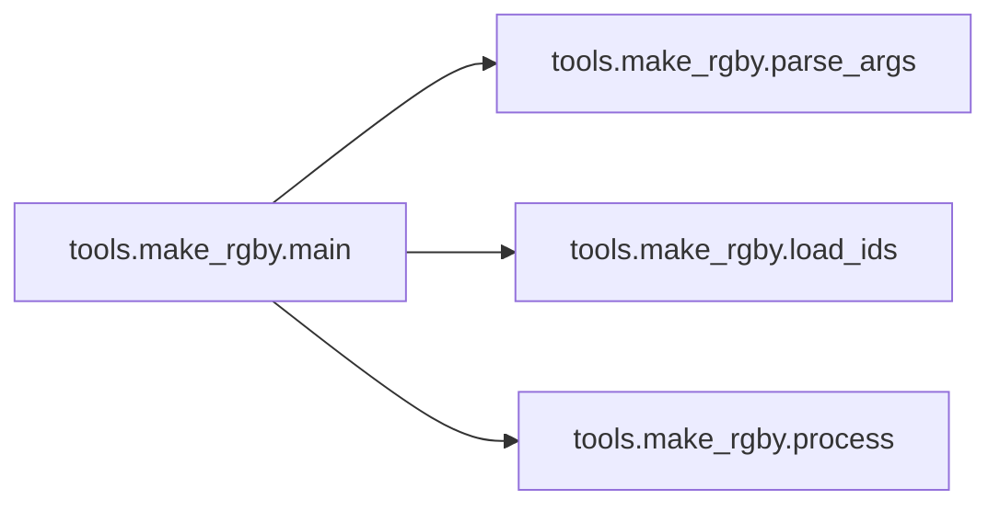

# Tools Make Rgby

[_Documentation generated by Documatic_](https://www.documatic.com)

<!---Documatic-section-Codebase Structure-start--->
## Codebase Structure

<!---Documatic-block-system_architecture-start--->
```mermaid
None
```
<!---Documatic-block-system_architecture-end--->

# #
<!---Documatic-section-Codebase Structure-end--->

<!---Documatic-section-tools.make_rgby.load_ids-start--->
## tools.make_rgby.load_ids

<!---Documatic-section-load_ids-start--->
<!---Documatic-block-tools.make_rgby.load_ids-start--->
<details>
	<summary><code>tools.make_rgby.load_ids</code> code snippet</summary>

```python
def load_ids(input_dir):
    red_filenames = glob.glob(input_dir + '/*_red.png')
    green_filenames = glob.glob(input_dir + '/*_green.png')
    blue_filenames = glob.glob(input_dir + '/*_blue.png')
    yellow_filenames = glob.glob(input_dir + '/*_yellow.png')
    return [filename[:-8] for filename in red_filenames]
```
</details>
<!---Documatic-block-tools.make_rgby.load_ids-end--->
<!---Documatic-section-load_ids-end--->

# #
<!---Documatic-section-tools.make_rgby.load_ids-end--->

<!---Documatic-section-tools.make_rgby.process-start--->
## tools.make_rgby.process

<!---Documatic-section-process-start--->
<!---Documatic-block-tools.make_rgby.process-start--->
<details>
	<summary><code>tools.make_rgby.process</code> code snippet</summary>

```python
def process(id_lists, output_dir):
    for id_str in tqdm.tqdm(id_lists):
        output_filename = os.path.join(output_dir, os.path.basename(id_str) + '.png')
        if os.path.exists(output_filename):
            continue
        red_filename = id_str + '_red.png'
        green_filename = id_str + '_green.png'
        blue_filename = id_str + '_blue.png'
        yellow_filename = id_str + '_yellow.png'
        if not os.path.exists(red_filename) or not os.path.exists(green_filename) or (not os.path.exists(blue_filename)) or (not os.path.exists(yellow_filename)):
            continue
        red = misc.imread(red_filename)
        green = misc.imread(green_filename)
        blue = misc.imread(blue_filename)
        yellow = misc.imread(yellow_filename)
        stacked = np.stack([red, green, blue, yellow], axis=2)
        misc.imsave(output_filename, stacked)
        result = misc.imread(output_filename)
```
</details>
<!---Documatic-block-tools.make_rgby.process-end--->
<!---Documatic-section-process-end--->

# #
<!---Documatic-section-tools.make_rgby.process-end--->

<!---Documatic-section-tools.make_rgby.parse_args-start--->
## tools.make_rgby.parse_args

<!---Documatic-section-parse_args-start--->
<!---Documatic-block-tools.make_rgby.parse_args-start--->
<details>
	<summary><code>tools.make_rgby.parse_args</code> code snippet</summary>

```python
def parse_args():
    parser = argparse.ArgumentParser()
    parser.add_argument('--input_dir', dest='input_dir', help='the directory of the input images', default=None, type=str)
    parser.add_argument('--output_dir', dest='output_dir', help='the directory of the output images', default=None, type=str)
    return parser.parse_args()
```
</details>
<!---Documatic-block-tools.make_rgby.parse_args-end--->
<!---Documatic-section-parse_args-end--->

# #
<!---Documatic-section-tools.make_rgby.parse_args-end--->

<!---Documatic-section-tools.make_rgby.main-start--->
## tools.make_rgby.main

<!---Documatic-section-main-start--->


### Object Calls

* tools.make_rgby.parse_args
* tools.make_rgby.load_ids
* tools.make_rgby.process

<!---Documatic-block-tools.make_rgby.main-start--->
<details>
	<summary><code>tools.make_rgby.main</code> code snippet</summary>

```python
def main():
    args = parse_args()
    assert args.input_dir is not None
    assert args.output_dir is not None
    os.makedirs(args.output_dir, exist_ok=True)
    id_lists = load_ids(args.input_dir)
    process(id_lists, args.output_dir)
```
</details>
<!---Documatic-block-tools.make_rgby.main-end--->
<!---Documatic-section-main-end--->

# #
<!---Documatic-section-tools.make_rgby.main-end--->

[_Documentation generated by Documatic_](https://www.documatic.com)