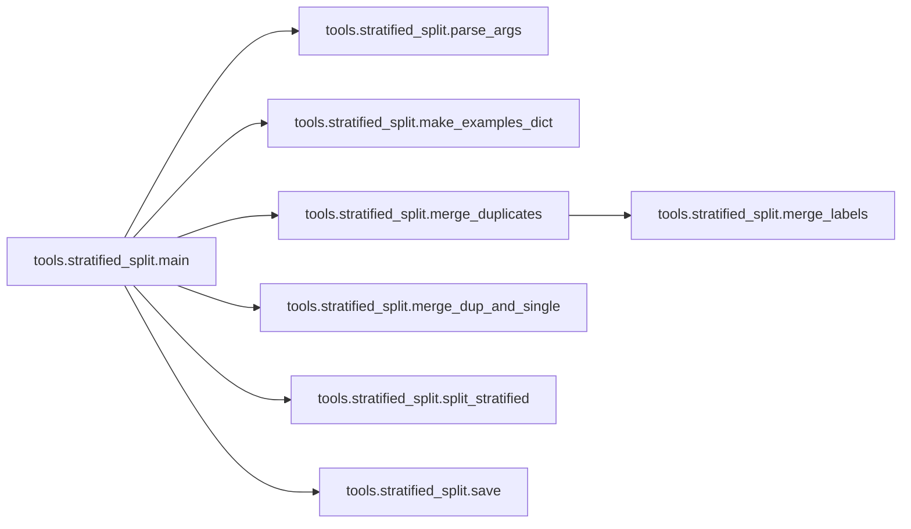

# Tools Stratified Split

[_Documentation generated by Documatic_](https://www.documatic.com)

<!---Documatic-section-Codebase Structure-start--->
## Codebase Structure

<!---Documatic-block-system_architecture-start--->
```mermaid
None
```
<!---Documatic-block-system_architecture-end--->

# #
<!---Documatic-section-Codebase Structure-end--->

<!---Documatic-section-tools.stratified_split.merge_labels-start--->
## tools.stratified_split.merge_labels

<!---Documatic-section-merge_labels-start--->
<!---Documatic-block-tools.stratified_split.merge_labels-start--->
<details>
	<summary><code>tools.stratified_split.merge_labels</code> code snippet</summary>

```python
def merge_labels(a, b):
    a_ids = a[0]
    b_ids = b[0]
    if set(a_ids) <= set(b_ids):
        return b[1]
    elif set(b_ids) <= set(a_ids):
        return a[1]
    max_len_a = max([len(v) for v in a[0]])
    max_len_b = max([len(v) for v in b[0]])
    if max_len_a > max_len_b:
        return a[1]
    elif max_len_a < max_len_b:
        return b[1]
    return a[1]
```
</details>
<!---Documatic-block-tools.stratified_split.merge_labels-end--->
<!---Documatic-section-merge_labels-end--->

# #
<!---Documatic-section-tools.stratified_split.merge_labels-end--->

<!---Documatic-section-tools.stratified_split.make_examples_dict-start--->
## tools.stratified_split.make_examples_dict

<!---Documatic-section-make_examples_dict-start--->
<!---Documatic-block-tools.stratified_split.make_examples_dict-start--->
<details>
	<summary><code>tools.stratified_split.make_examples_dict</code> code snippet</summary>

```python
def make_examples_dict(df, use_external):
    dup_examples_dict = {}
    single_examples_dict = {}
    for (_, row) in tqdm.tqdm(df.iterrows()):
        ids = tuple(sorted(row['Ids'].split(' ')))
        if not use_external:
            train_id_str_len = len('050a106a-bbc1-11e8-b2bb-ac1f6b6435d0')
            ids = tuple([v for v in ids if len(v) == train_id_str_len])
        if len(ids) == 0:
            continue
        labels = [int(l) for l in row['Target'].split(' ')]
        if len(ids) > 1:
            dup_examples_dict[ids] = set(labels)
        else:
            single_examples_dict[ids] = set(labels)
    return (dup_examples_dict, single_examples_dict)
```
</details>
<!---Documatic-block-tools.stratified_split.make_examples_dict-end--->
<!---Documatic-section-make_examples_dict-end--->

# #
<!---Documatic-section-tools.stratified_split.make_examples_dict-end--->

<!---Documatic-section-tools.stratified_split.merge_duplicates-start--->
## tools.stratified_split.merge_duplicates

<!---Documatic-section-merge_duplicates-start--->


### Object Calls

* tools.stratified_split.merge_labels

<!---Documatic-block-tools.stratified_split.merge_duplicates-start--->
<details>
	<summary><code>tools.stratified_split.merge_duplicates</code> code snippet</summary>

```python
def merge_duplicates(dup_examples_dict):
    while True:
        dup_examples = list(dup_examples_dict.items())
        len_before = len(dup_examples)
        dup_examples_dict = {}
        for (a, b) in tqdm.tqdm(combinations(dup_examples, 2)):
            intersection = set(a[0]) & set(b[0])
            if len(intersection) > 0:
                union = set(a[0]) | set(b[0])
                dup_examples_dict[tuple(sorted(list(union)))] = merge_labels(a, b)
        for example in tqdm.tqdm(dup_examples):
            is_pass = False
            for (ids, target) in dup_examples_dict.items():
                if set(example[0]) <= set(ids):
                    is_pass = True
                    break
            if is_pass == False:
                dup_examples_dict[example[0]] = example[1]
        len_after = len(dup_examples_dict)
        if len_before == len_after:
            break
    return dup_examples_dict
```
</details>
<!---Documatic-block-tools.stratified_split.merge_duplicates-end--->
<!---Documatic-section-merge_duplicates-end--->

# #
<!---Documatic-section-tools.stratified_split.merge_duplicates-end--->

<!---Documatic-section-tools.stratified_split.merge_dup_and_single-start--->
## tools.stratified_split.merge_dup_and_single

<!---Documatic-section-merge_dup_and_single-start--->
<!---Documatic-block-tools.stratified_split.merge_dup_and_single-start--->
<details>
	<summary><code>tools.stratified_split.merge_dup_and_single</code> code snippet</summary>

```python
def merge_dup_and_single(dup_examples_dict, single_examples_dict):
    all_examples_dict = {}
    for (key, value) in tqdm.tqdm(single_examples_dict.items()):
        is_dup = False
        for dup_key in dup_examples_dict.keys():
            if set(key) <= set(dup_key):
                is_dup = True
                break
        if is_dup == False:
            all_examples_dict[key] = value
    all_examples_dict.update(dup_examples_dict)
    return all_examples_dict
```
</details>
<!---Documatic-block-tools.stratified_split.merge_dup_and_single-end--->
<!---Documatic-section-merge_dup_and_single-end--->

# #
<!---Documatic-section-tools.stratified_split.merge_dup_and_single-end--->

<!---Documatic-section-tools.stratified_split.split_stratified-start--->
## tools.stratified_split.split_stratified

<!---Documatic-section-split_stratified-start--->
<!---Documatic-block-tools.stratified_split.split_stratified-start--->
<details>
	<summary><code>tools.stratified_split.split_stratified</code> code snippet</summary>

```python
def split_stratified(all_examples_dict):
    examples = []
    y_list = []
    for (key, labels) in all_examples_dict.items():
        labels = list(labels)
        np_labels = np.zeros((28,), dtype=int)
        np_labels[np.array(labels)] = 1
        examples.append((key, labels))
        y_list.append(np_labels)
    X = np.arange(len(y_list))
    y = np.array(y_list)
    mskf = MultilabelStratifiedKFold(n_splits=11, random_state=1234)
    folds = []
    for (train_index, test_index) in mskf.split(X, y):
        folds.append(test_index)
    for (a, b) in combinations(folds, 2):
        assert len(set(a) & set(b)) == 0
    return (examples, folds)
```
</details>
<!---Documatic-block-tools.stratified_split.split_stratified-end--->
<!---Documatic-section-split_stratified-end--->

# #
<!---Documatic-section-tools.stratified_split.split_stratified-end--->

<!---Documatic-section-tools.stratified_split.save-start--->
## tools.stratified_split.save

<!---Documatic-section-save-start--->
<!---Documatic-block-tools.stratified_split.save-start--->
<details>
	<summary><code>tools.stratified_split.save</code> code snippet</summary>

```python
def save(examples, folds, num_fold, data_dir, use_external):
    for fold_idx in range(num_fold):
        records = []
        for (i, indices) in enumerate(folds):
            if i == fold_idx * 2 or i == fold_idx * 2 + 1:
                for j in indices:
                    for id_str in examples[j][0]:
                        records.append((id_str, ' '.join([str(v) for v in examples[j][1]]), 'val'))
            elif i == 10:
                for j in indices:
                    for id_str in examples[j][0]:
                        records.append((id_str, ' '.join([str(v) for v in examples[j][1]]), 'test_val'))
            else:
                for j in indices:
                    for id_str in examples[j][0]:
                        records.append((id_str, ' '.join([str(v) for v in examples[j][1]]), 'train'))
        df = pd.DataFrame.from_records(records, columns=['Id', 'Target', 'Split'])
        if use_external:
            output_filename = os.path.join(data_dir, 'split.stratified.{}.csv'.format(fold_idx))
        else:
            output_filename = os.path.join(data_dir, 'split.stratified.small.{}.csv'.format(fold_idx))
        df.to_csv(output_filename, index=False)
```
</details>
<!---Documatic-block-tools.stratified_split.save-end--->
<!---Documatic-section-save-end--->

# #
<!---Documatic-section-tools.stratified_split.save-end--->

<!---Documatic-section-tools.stratified_split.parse_args-start--->
## tools.stratified_split.parse_args

<!---Documatic-section-parse_args-start--->
<!---Documatic-block-tools.stratified_split.parse_args-start--->
<details>
	<summary><code>tools.stratified_split.parse_args</code> code snippet</summary>

```python
def parse_args():
    parser = argparse.ArgumentParser()
    parser.add_argument('--data_dir', dest='data_dir', help='the directory of the data', default='data', type=str)
    parser.add_argument('--use_external', dest='use_external', help='1: with external, 0: without external', default=1, type=int)
    return parser.parse_args()
```
</details>
<!---Documatic-block-tools.stratified_split.parse_args-end--->
<!---Documatic-section-parse_args-end--->

# #
<!---Documatic-section-tools.stratified_split.parse_args-end--->

<!---Documatic-section-tools.stratified_split.main-start--->
## tools.stratified_split.main

<!---Documatic-section-main-start--->


### Object Calls

* tools.stratified_split.parse_args
* tools.stratified_split.make_examples_dict
* tools.stratified_split.merge_duplicates
* tools.stratified_split.merge_dup_and_single
* tools.stratified_split.split_stratified
* tools.stratified_split.save

<!---Documatic-block-tools.stratified_split.main-start--->
<details>
	<summary><code>tools.stratified_split.main</code> code snippet</summary>

```python
def main():
    args = parse_args()
    num_fold = 5
    data_dir = args.data_dir
    use_external = args.use_external == 1
    df_phash = pd.read_csv(os.path.join(data_dir, 'duplicates.phash.csv'))
    df_ahash = pd.read_csv(os.path.join(data_dir, 'duplicates.ahash.csv'))
    (dup_examples_dict, single_examples_dict) = make_examples_dict(df_phash, use_external)
    (dup_examples_dict_a, single_examples_dict_a) = make_examples_dict(df_ahash, use_external)
    dup_examples_dict.update(dup_examples_dict_a)
    single_examples_dict.update(single_examples_dict_a)
    print('len(dup_examples):', len(dup_examples_dict))
    print('len(single_examples):', len(single_examples_dict))
    dup_examples_dict = merge_duplicates(dup_examples_dict)
    all_examples_dict = merge_dup_and_single(dup_examples_dict, single_examples_dict)
    all_examples_dict = merge_dup_and_single(dup_examples_dict, single_examples_dict)
    print('len(all_examples_dict):', len(all_examples_dict))
    (examples, folds) = split_stratified(all_examples_dict)
    save(examples, folds, num_fold, data_dir, use_external)
```
</details>
<!---Documatic-block-tools.stratified_split.main-end--->
<!---Documatic-section-main-end--->

# #
<!---Documatic-section-tools.stratified_split.main-end--->

[_Documentation generated by Documatic_](https://www.documatic.com)