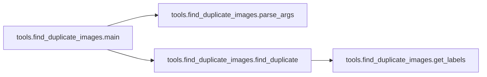

# Tools Find Duplicate Images

[_Documentation generated by Documatic_](https://www.documatic.com)

<!---Documatic-section-Codebase Structure-start--->
## Codebase Structure

<!---Documatic-block-system_architecture-start--->
```mermaid
None
```
<!---Documatic-block-system_architecture-end--->

# #
<!---Documatic-section-Codebase Structure-end--->

<!---Documatic-section-tools.find_duplicate_images.get_labels-start--->
## tools.find_duplicate_images.get_labels

<!---Documatic-section-get_labels-start--->
<!---Documatic-block-tools.find_duplicate_images.get_labels-start--->
<details>
	<summary><code>tools.find_duplicate_images.get_labels</code> code snippet</summary>

```python
def get_labels(id_list, df_train, df_external):
    train_labels = set()
    external_labels = set()
    for id_str in id_list:
        if id_str in df_train.index:
            labels = df_train.loc[id_str]['Target'].split(' ')
            labels_str = ' '.join(sorted(labels))
            train_labels.add(labels_str)
        elif id_str in df_external.index:
            labels = df_external.loc[id_str]['Target'].split(' ')
            labels_str = ' '.join(sorted(labels))
            external_labels.add(labels_str)
        else:
            print(id_str, 'is not in df_train or df_external')
            return None
    if len(train_labels) == 0:
        return list(external_labels)[0]
    return list(train_labels)[0]
```
</details>
<!---Documatic-block-tools.find_duplicate_images.get_labels-end--->
<!---Documatic-section-get_labels-end--->

# #
<!---Documatic-section-tools.find_duplicate_images.get_labels-end--->

<!---Documatic-section-tools.find_duplicate_images.find_duplicate-start--->
## tools.find_duplicate_images.find_duplicate

<!---Documatic-section-find_duplicate-start--->


### Object Calls

* tools.find_duplicate_images.get_labels

<!---Documatic-block-tools.find_duplicate_images.find_duplicate-start--->
<details>
	<summary><code>tools.find_duplicate_images.find_duplicate</code> code snippet</summary>

```python
def find_duplicate(hash_func, df_train, df_external, train_filenames, external_filenames):
    images_dict = defaultdict(list)
    for filename in tqdm.tqdm(train_filenames):
        image = Image.open(filename)
        h = hash_func(image)
        images_dict[h].append(filename)
    for filename in tqdm.tqdm(external_filenames):
        image = Image.open(filename)
        h = hash_func(image)
        images_dict[h].append(filename)
    records = []
    for (key, values) in images_dict.items():
        id_list = [os.path.basename(v)[:-len('_green.png')] for v in values]
        values_str = ' '.join(id_list)
        if str(key) == '0000000000000000':
            for id_str in id_list:
                labels = get_labels([id_str], df_train, df_external)
                assert labels is not None
                records.append((key, id_str, labels))
        else:
            labels = get_labels(id_list, df_train, df_external)
            assert labels is not None
            records.append((key, values_str, labels))
    df = pd.DataFrame.from_records(records, columns=['hash', 'Ids', 'Target'])
    return df
```
</details>
<!---Documatic-block-tools.find_duplicate_images.find_duplicate-end--->
<!---Documatic-section-find_duplicate-end--->

# #
<!---Documatic-section-tools.find_duplicate_images.find_duplicate-end--->

<!---Documatic-section-tools.find_duplicate_images.parse_args-start--->
## tools.find_duplicate_images.parse_args

<!---Documatic-section-parse_args-start--->
<!---Documatic-block-tools.find_duplicate_images.parse_args-start--->
<details>
	<summary><code>tools.find_duplicate_images.parse_args</code> code snippet</summary>

```python
def parse_args():
    parser = argparse.ArgumentParser()
    parser.add_argument('--data_dir', dest='data_dir', help='the directory of the data', default='data', type=str)
    return parser.parse_args()
```
</details>
<!---Documatic-block-tools.find_duplicate_images.parse_args-end--->
<!---Documatic-section-parse_args-end--->

# #
<!---Documatic-section-tools.find_duplicate_images.parse_args-end--->

<!---Documatic-section-tools.find_duplicate_images.main-start--->
## tools.find_duplicate_images.main

<!---Documatic-section-main-start--->


### Object Calls

* tools.find_duplicate_images.parse_args
* tools.find_duplicate_images.find_duplicate

<!---Documatic-block-tools.find_duplicate_images.main-start--->
<details>
	<summary><code>tools.find_duplicate_images.main</code> code snippet</summary>

```python
def main():
    args = parse_args()
    raw_images_dir = os.path.join(args.data_dir, 'raw')
    train_dir = os.path.join(raw_images_dir, 'train')
    external_dir = os.path.join(raw_images_dir, 'external')
    train_filenames = list(glob.glob(os.path.join(train_dir, '*_green.png')))
    external_filenames = list(glob.glob(os.path.join(external_dir, '*_green.png')))
    hash_func = {'phash': imagehash.phash, 'ahash': imagehash.average_hash}
    df_train = pd.read_csv(os.path.join(args.data_dir, 'train.csv'), index_col='Id')
    df_external = pd.read_csv(os.path.join(args.data_dir, 'external.csv'), index_col='Id')
    for (hash_type, hash_func) in hash_func.items():
        df_duplicate = find_duplicate(hash_func, df_train, df_external, train_filenames, external_filenames)
        output_filename = os.path.join(args.data_dir, 'duplicates.{}.csv'.format(hash_type))
        df_duplicate.to_csv(output_filename, index=False)
```
</details>
<!---Documatic-block-tools.find_duplicate_images.main-end--->
<!---Documatic-section-main-end--->

# #
<!---Documatic-section-tools.find_duplicate_images.main-end--->

[_Documentation generated by Documatic_](https://www.documatic.com)